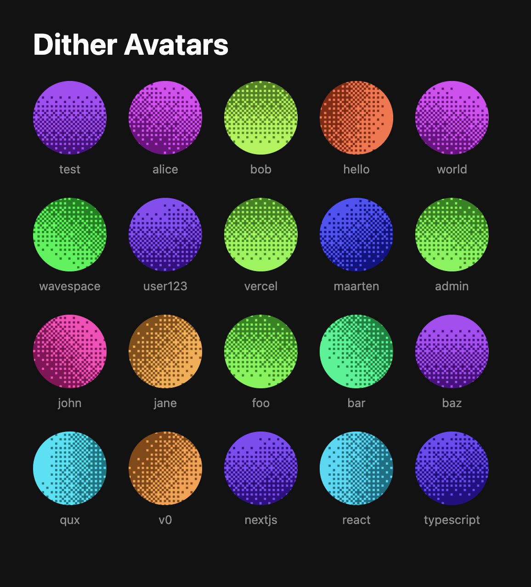

# dither-avatar

Deterministic dithered SVG avatars from any seed string. Zero dependencies.



**[Live playground &rarr;](https://dither-avatar.pages.dev)**

## Install

```bash
npm install dither-avatar
```

## Usage

### Core (any JS runtime)

```js
import { generateDitherAvatar, ditherAvatarDataUri } from 'dither-avatar';

const svg = generateDitherAvatar('alice');
const uri = ditherAvatarDataUri('alice');
```

### React

```jsx
import { DitherAvatar } from 'dither-avatar/react';

function UserProfile({ username }) {
  return <DitherAvatar seed={username} size={48} />;
}
```

## API

### `generateDitherAvatar(seed: string): string`

Returns raw SVG markup for the given seed.

### `ditherAvatarDataUri(seed: string): string`

Returns a `data:image/svg+xml,...` URI — safe to use as an `` src.

### `<DitherAvatar seed size? className? style? />`

Renders an `` with the avatar as a data URI. Zero XSS risk.

### `<DitherAvatarSVG seed size? className? style? />`

Renders an inline `<svg>`. Note: uses `dangerouslySetInnerHTML`.

## License

MIT
